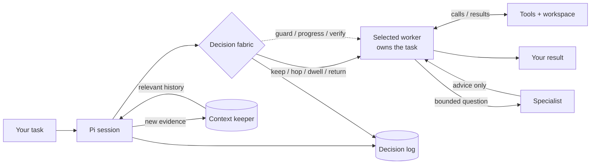
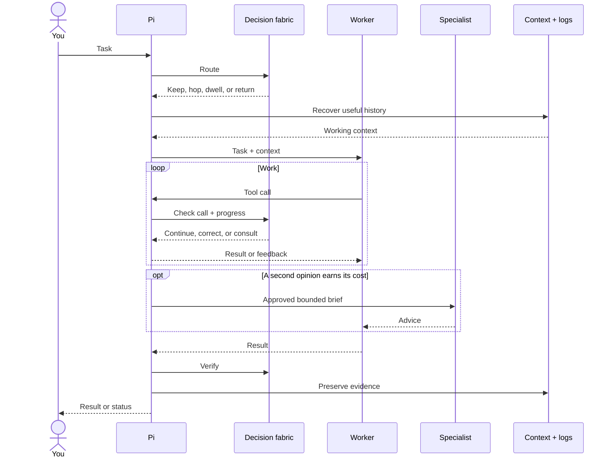

# geocine-pi

Most coding agents make one model do everything. geocine-pi keeps your
chosen worker in charge, then brings in routing, memory, or a specialist
only when the work earns it.

**Your selected worker owns the task from start to finish.**

## What's in the loop?



Read the solid line from left to right: task, route, worker, result. The
dotted line shows oversight around the worker.

Context restores evidence; a specialist answers one bounded question.
Neither takes ownership from the selected worker.

---

## What happens after you press Enter?



**A model hop changes who runs the turn. It doesn't hand over ownership.**

---

## How do you run it?

```bash
pi install /path/to/geocine-pi
cp geocine.example.json ~/.pi/agent/geocine.json
export TYPESAFE_API_KEY=...
pi
```

```text
/geocine
/consult @frontier +docs/outline.md is this topic order right?
```

`/geocine` opens the control hub. `/consult` asks one configured model one
bounded question.

---

## Where should you read next?

Start with the [documentation map](docs/flows.md) and pick the question
that matches what surprised you.

If you already know the setting, jump to the
[configuration reference](docs/configuration.md).
