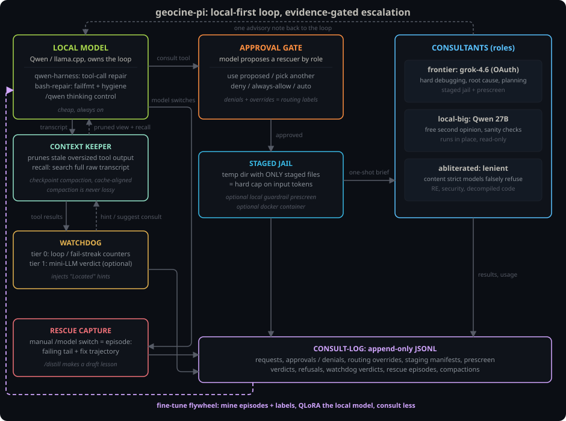

# geocine-pi

Local-first plugin set for [pi](https://github.com/earendil-works/pi): the
model you pick in pi's model picker owns the loop — typically a cheap one,
local llama.cpp or a budget cloud host, and nothing here ever switches it;
a System One decision fabric (a ~100 ms
classifier, never LLM tokens) makes the micro-decisions — route this task?
command too risky? actually done? escalate now? — stronger models are
consulted on evidence, behind a user approval gate, inside a context-capped
jail; and every decision — fabric verdicts, approvals, denials, routing
overrides, refusals, manual rescues — is logged as training data for both
the worker and your own offline judge.



## Extensions

| Extension | What it does | Invocation |
| --- | --- | --- |
| `advisor` | `consult` tool: stages a minimal snapshot, optional guardrail pre-screen, runs a consulted model, returns one advisory note. Models are addressed by capability class (`frontier`, `cheap`, `fast`, `local`, `abliterated`, `intelligent`, `default`) — proposed by the worker or assigned by the judge per task (role, classes, cost, guardrail fit; cheapest that covers the need); registry names are internal config labels, every surface shows `provider/model {classes}`. User approves, overrides, or denies. Staged jails are enforced by a sentry injected into the child: reads outside the staging dir are blocked, audited, and reported in the result. | `consult` tool, `/consult`, `/models` |
| `ask-user` | `ask_user` tool: lets the model ask you one question (pick-one options or free text) via pi's own dialogs — so it never improvises file/plugin-based prompting mechanisms from its training data. | `ask_user` tool |
| `watchdog` | Loop/fail-streak counters plus, with a judge configured, an every-turn classifier verdict (the only tier that catches drift) and a mid-task escalate-now check; injects "Located" hints. | Automatic. `/watchdog` |
| `triage` | Judge-powered task routing at submission: scores difficulty for the local model and picks local / plan-first / frontier against the session stage (invested tokens = warm cache but lossy handoff). Confident non-local routes steer the model toward an early consult; every verdict is a task→route training label. | Automatic |
| `outcome-gate` | Verifies the work product when the agent settles: git diff read directly, test/lint outputs captured from what the agent already ran, judged into continue (nudge the local model on — premature "done" is common) / stop (done or needs you) / escalate (suggest a consult). Parallel review flags on the same call: revert (digging deeper), regression risk, scope creep, architectural change, needs-more-tests, and a needs-human override that suppresses nudges at human decision points. | Automatic |
| `command-guard` | Destructive-looking shell commands (rm -rf, git reset --hard, force push, DROP TABLE, ...) pass a deterministic prefilter, then the judge decides against the current task: serves it, or collateral damage? Confident collateral damage is blocked with a reason the model sees. No judge = allow; pi's own tool approval stays the real gate. | Automatic |
| `tool-guard` | Call-level waste detection for cheap workers weak at tool use (`rescue.localProviders` — local or budget cloud): exact-call repeats, identical retries after a failure, and 3+ re-reads of the same file pass a deterministic prefilter, then the judge decides against the recent calls: did anything change, or is this thrash? Confident thrash is blocked with a corrective reason (use recall / change approach). Frontier workers are never guarded; capped per task; no judge = allow. | Automatic |
| `rescue` | Captures manual local-to-frontier `/model` switches as training episodes; drafts lessons from them. | Automatic. `/distill` |
| `context-keeper` | Long-session context management: early + idle compaction for local providers, classifier-scored compaction digest (the judge scores every step drop / keep / expand-verbatim; deterministic without a judge, LLM checkpoint optional), judge-expired pinned `note`s with a pre-cut reminder, ingestion-time pruning of big shell outputs, `recall` transcript search (exact + BM25 fallback + judge rerank + full entry read-back), and a task-start memory gate that steers confidently-relevant compacted history back in (Zero-Mem style: memory ops cost zero LLM tokens) so compaction is never lossy. | Automatic. `recall`, `note` tools |
| `worked-timer` | Codex-style run timing: live elapsed on the "Working..." line, "Worked for Xm Ys · turns · tool calls" summary per run (approval-dialog wait time excluded). | Automatic |
| `geocine-menu` | One hub menu for everything above; every row shows its current state (models, approval, context, watchdog, rescue, training data). | `/geocine` |
| `bash-repair` | Strips terminal noise; prepends compact failure summaries (go/cargo/pytest/node). | Automatic |
| `pdf-reader` | `read_pdf` tool: native PDF inspection via [@firecrawl/pdf-inspector](https://github.com/firecrawl/pdf-inspector) (Rust, ~150ms per text PDF) — classifies text-based vs scanned, extracts per-page Markdown (tables, headings, multi-column reading order), takes 1-indexed page ranges, and searches across pages. Output is budget-capped (`pdf.maxChars`); omitted pages are named so the model pages through instead of flooding context. Scanned pages are flagged, not OCR'd. | `read_pdf` tool |
| `models/` | Per-model-family harness registry, one file per family. Advertises each model's RL-trained tool dialect on the wire (qwen-code names for Qwen, grok-build names for Grok, codex `exec_command` + a native `apply_patch` for OpenAI) while pi's tools and transcript stay canonical. Fills the trained-tool gaps pi does not cover: a shared `todo` plan tool (aliased as `todo_write` / `update_plan`), `web_fetch` + `web_search` (qwen/grok only; pluggable backends — TinyFish APIs when a key is configured, builtin DuckDuckGo scrape otherwise, `web.provider` pins one), `view_image`, and dialect envelopes over `ask_user`. Model-owned tools are hidden from models that were not trained on them. Plus Qwen tool-call recovery, llama.cpp schema fixes, and thinking budgets. | Automatic. `/harness` |
| `baseten-limits` | Client-side RPM/TPM pacing + server `429 retry_after` handling for Baseten. | Automatic |
| `lib/judge` | The System One decision fabric ([TypeSafe Jev](https://docs.typesafe.ai) backend): typed noul/choice/score judgments with calibrated probabilities in ~100–500 ms. Nodes: watchdog verdicts, task triage, outcome gate, command guard, tool guard (wasteful-call blocks for weak tool-callers), recall rerank, compaction scoring (drop/keep/expand per digest step), note expiry, task-start memory gate, consult routing, consult approval (auto-approves clear consults, asks when unsure, never auto-denies), consult prescreen — all sharing one rate cap and a per-node stats ledger. Degradation ladder per call: Jev → naive-llm fallback (one deliberately-dumb temperature-0 JSON completion on the local llama.cpp server, probs clamped) → call-site heuristics. Every answered call is traced to JSONL as a ready-to-train `(context, schema, labels)` row with tier provenance — the dataset for your own offline constrained-decoding classifier; once trained, repoint `judge.provider` and decisions run free. | Automatic. `/geocine judge` |
| `abliteration-cache` | Prompt-cache routing hint for abliteration.ai: sends a stable per-session `prompt_cache_key` so requests land on the same cached prefix (cache reads bill at 10% of input). | Automatic |

## Install

```bash
pi install /path/to/geocine-pi          # global, live-editable
cp geocine.example.json ~/.pi/agent/geocine.json   # then edit the model registry
```

## Quick start

```bash
pi
/geocine                 # hub: models, approval mode, toggles, logs, lessons
/consult @frontier +docs/outline.md is this topic order right?   # + tokens stage files
```

When the worker gets stuck it calls the `consult` tool itself,
proposing a model by class and role (or letting the judge route) — you
approve, pick another, or deny. Every outcome lands in the consult-log.

## Docs

- [Configuration](docs/configuration.md) — the model registry, classes, roles, jails, approval gate, watchdog, testing
- [Local Qwen server](docs/local-qwen.md) — recommended `llama-server` launch flags for Qwen3.8-27B and why they matter
- [Context management](docs/context.md) — compaction modes, ingestion pruner, recall tool, and the research behind them
- [Training data](docs/training-data.md) — the decision log, the judge trace (train your own offline judge), rescue episodes, mining history, lessons
