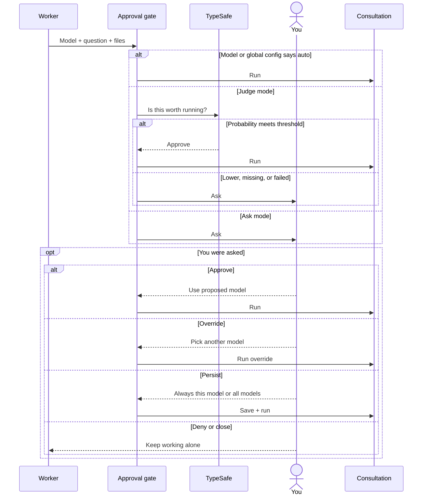
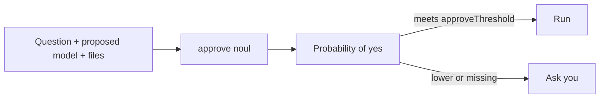

# Why did Pi ask before consulting?

A consultation can spend tokens and expose staged files. The worker
shouldn't get to spend either without a rule you chose.

**TypeSafe may approve. It never denies for you.**

## Who makes the call?



| Mode | What happens |
| --- | --- |
| `ask` | You approve, override, deny, or persist a choice |
| `judge` | A strong yes runs; every other outcome asks you |
| `auto` | Worker-requested consults run without a prompt |
| model `autoApprove: true` | That model skips the prompt |
| your `/consult` command | Runs directly |

Headless runs proceed because there is no UI to answer. Starting that run
counts as prior approval.

---

## What does TypeSafe classify?



<details>
<summary>Open the actual TypeSafe POST body</summary>

```jsonc
{
  "state": {
    "question": "Should we change the cache key strategy?",
    "model": "grok-4.6",
    "role": "hard debugging and planning",
    "classes": ["frontier", "intelligent"],
    "jail": "staged",
    "proposed_by": "judge",
    "staged_files": ["lib/cache.ts", "test/cache.test.ts"]
  },
  "model": "jev-latest",
  "questions": {
    "approve": {
      "type": "noul",
      "instructions": "The local worker wants to consult `model` (see `role`, `classes`) with `question`, staging `staged_files`. Should this run WITHOUT asking the user? Approve when the question is specific and substantive, the staged files are minimal and relevant, and the model's classes fit the need — cheap/local/fast consults need little justification, while frontier/intelligent-class ones must look genuinely beyond the local worker. When in doubt, ask.",
      "criteria": {
        "true": "Clearly justified and well-routed — run it without interrupting the user",
        "false": "Doubtful: vague question, over-staging, or cost/class mismatch — ask the user"
      }
    }
  }
}
```

The values are examples. The fields, classifier question, and criteria
match the runtime payload. `question` stops at 600 characters;
`staged_files` stops at twenty.

</details>

```json
{
  "model": "jev-1.13",
  "answers": {
    "approve": {
      "type": "noul",
      "noul": 0.91
    }
  }
}
```

`noul` means “probability of true.” If it misses
`approval.approveThreshold`, Pi asks you.

---

## How do you set the rule?

```jsonc
{
  "approval": {
    "consultTool": "ask",
    "approveThreshold": 0.85
  }
}
```

Set `models.<name>.autoApprove` when one model has earned a permanent
exception. Choosing a persistent option in the dialog writes the global
config immediately.

---

## What gets learned?

A denial is logged even though no consultant ran. An override becomes a
direct correction to the routing decision.

Those human labels are stronger than a classifier guess.

Implementation: `extensions/advisor.ts`.

Next: [what the approved model can read](consultation-isolation.md).
