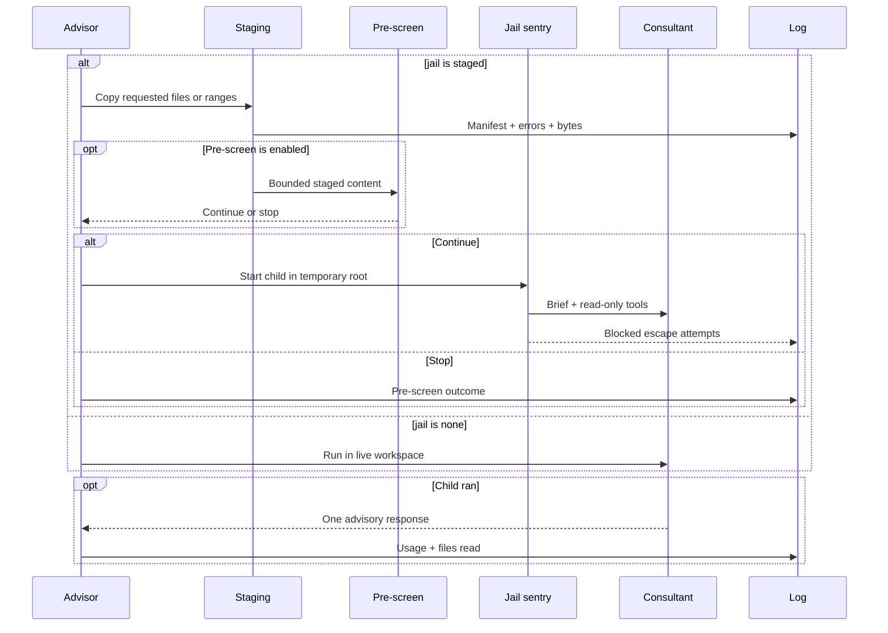

# What can the consultant read?

Read-only isn't the same as bounded. A model that can read your whole
repo can still consume context and see files you never meant to send.

**`staged` exposes the files you named. `none` exposes the live workspace.**

## Where does the child run?



Routing answers *who*. Approval answers *whether*. Isolation answers
*what that model can see*.

---

## What does `staged` copy?

| Input | What enters the temporary workspace |
| --- | --- |
| `+src/file.ts` | The whole file with its relative path |
| `+src/file.ts:12-80` | That line range |
| Path outside the workspace | A file flattened to its basename |
| File over 256 KiB | A truncated file plus a staging error |
| Missing or unreadable file | Nothing, plus a recorded error |
| No successful files | A question-only run with no tools |

The brief tells the consultant that this temporary directory is the
*entire* workspace. The sentry blocks and records reads outside it.

---

## When should you use `none`?

`jail: "none"` skips staging and runs in your active workspace. Tools stay
read-only, but paths aren't bounded.

You might think read-only makes this equally safe. It prevents writes; it
doesn't prevent broad reads.

Use live mode only when that wider boundary is deliberate. It also skips
pre-screening because there is no staged payload.

---

## What does the child get?

The consultant runs in a separate, sessionless Pi process with:

- the selected provider, model, and thinking level;
- one bounded brief;
- read-only tools when a workspace exists;
- a 15-minute timeout;
- one `SEVERITY`, `ADVICE`, and optional `PLAN` response.

It returns one advisory note. It never inherits the main tool loop.

---

## How do you choose the boundary?

```jsonc
{
  "models": {
    "reviewer": {
      "provider": "xai",
      "model": "grok-4.6",
      "jail": "staged",
      "thinking": "high",
      "notes": "Focus on correctness and scope."
    }
  }
}
```

Keep `staged` unless you want the consultant to inspect the wider
workspace.

The log keeps requested paths, copied paths, line ranges, bytes, errors,
actual reads, and blocked escapes.

Implementation: `extensions/advisor.ts`, `lib/jail-sentry.ts`, and
`lib/pi-exec.ts`.

Next: [what happens before a strict consultant launches](consultation-prescreen.md).
