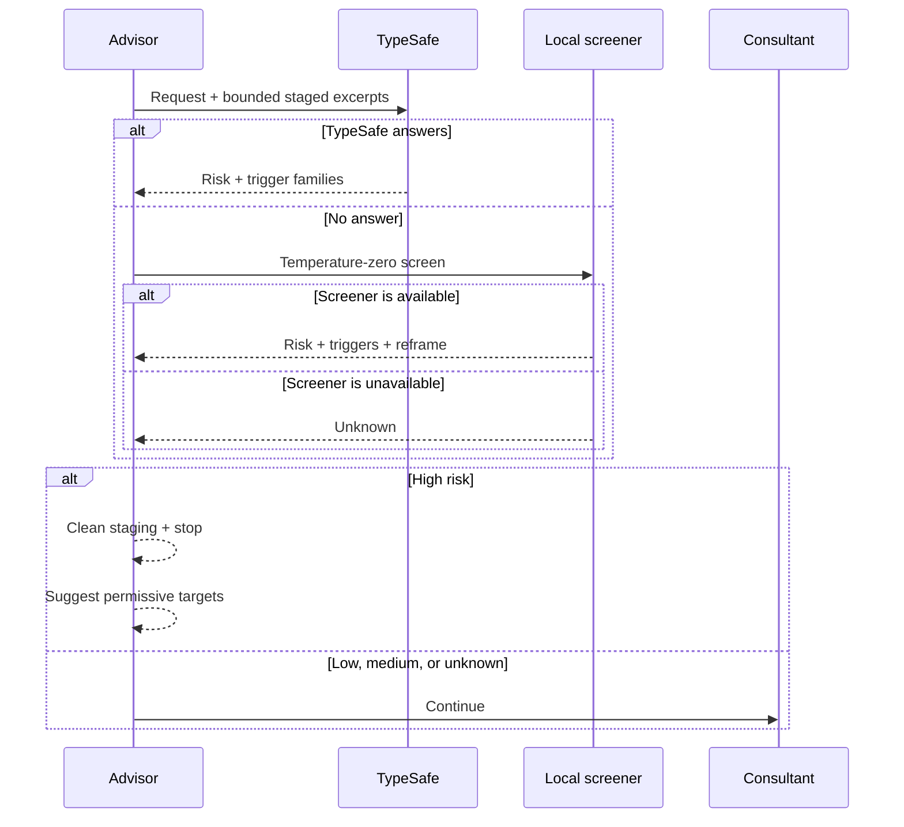
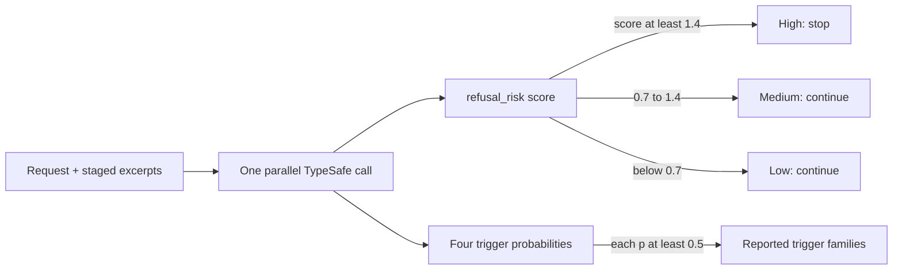

# Why did the consultation stop before launch?

A strict consultant can consume the brief and return a refusal. The
pre-screen predicts that dead end before Pi starts an expensive child.

**Only a high-risk result stops the consultation.**

## What happens first?



TypeSafe gets the first attempt. One configured local model is the
fallback, but only when it runs on a safe separate endpoint.

---

## What does TypeSafe classify?



<details>
<summary>Open the actual TypeSafe POST body</summary>

```jsonc
{
  "state": {
    "request": "Review this parser.",
    "files": [
      {
        "file": "src/parser.ts",
        "content": "export function parse(input: string) { /* staged excerpt */ }"
      }
    ]
  },
  "model": "jev-latest",
  "questions": {
    "refusal_risk": {
      "type": "score",
      "instructions": "The `files` plus `request` are about to be sent to a strict cloud LLM. How likely is that model to REFUSE? Count NSFW/adult/sexual content and blackhat-borderline work (exploit payloads, protection bypass, malware, unauthorized access). Do NOT count ordinary reverse engineering (decompile/disassemble to understand a binary) or defensive analysis — aligned models handle those.",
      "criteria": [
        "Benign — coding, research, or ordinary reverse engineering; a refusal is very unlikely",
        "Some risky-looking surface (secrets, security tooling that looks offensive, adult/NSFW mention); a refusal is plausible",
        "Strict model will likely refuse — explicit NSFW/adult, or blackhat-borderline work (exploit payloads, protection bypass, malware)"
      ]
    },
    "t_exploit": {
      "type": "noul",
      "instructions": "Does `files` contain exploit-like or offensive-security code (shellcode, payloads, bypass tooling)?"
    },
    "t_re": {
      "type": "noul",
      "instructions": "Does `files` or `request` weaponize reverse engineering — protection/DRM bypass, license cracks, malware unpackers for deployment, unauthorized access? Ordinary decompiled code or disassembly to understand a program does not count."
    },
    "t_secrets": {
      "type": "noul",
      "instructions": "Does `files` contain credentials, API keys, tokens, or personal data?"
    },
    "t_prose": {
      "type": "noul",
      "instructions": "Does `files` or `request` contain NSFW/adult/sexual content (including captions of adult images), or violent, extremist, or otherwise policy-sensitive prose?"
    }
  }
}
```

The request and file text are examples. The five questions, criteria,
and surrounding fields match the runtime payload.

</details>

```json
{
  "model": "jev-1.13",
  "answers": {
    "refusal_risk": {
      "type": "score",
      "score": 0.18,
      "legend": {
        "0": "Benign",
        "1": "Plausible refusal",
        "2": "Likely refusal"
      },
      "probabilities": {
        "0": 0.87,
        "1": 0.08,
        "2": 0.05
      },
      "confidence": 0.87
    },
    "t_exploit": { "type": "noul", "noul": 0.03 },
    "t_re": { "type": "noul", "noul": 0.02 },
    "t_secrets": { "type": "noul", "noul": 0.04 },
    "t_prose": { "type": "noul", "noul": 0.01 }
  }
}
```

The score is the probability-weighted position across levels `0..2`.
Each `noul` is independent, so one request can report several trigger
families.

---

## When does this run?

All three conditions must hold:

1. the model has `prescreen: true`;
2. its *effective* jail is `staged` (`auto` counts when it resolves there);
3. at least one file reached staging.

A question-only consult and a live (`none`) run skip the pre-screen.

---

## What does each result do?

| Result | Action |
| --- | --- |
| `low` | Continue |
| `medium` | Continue, with a benign reframe when available |
| `unknown` | Continue without a screen |
| `high` | Stop before contacting the consultant |

A high result doesn't swap models behind your back. The worker gets the
likely triggers and the available permissive alternatives.

---

## How do you turn it on?

```jsonc
{
  "prescreen": {
    "model": "qwen-27b",
    "maxBytes": 24576
  },
  "models": {
    "strict-reviewer": {
      "provider": "xai",
      "model": "grok-4.6",
      "jail": "staged",
      "prescreen": true
    }
  }
}
```

The fallback model uses the same registry and availability checks as a
consultant.

---

## Why doesn't `unknown` block?

You might expect safety logic to fail closed. This screen predicts model
compatibility; it isn't the permission boundary.

Blocking when TypeSafe or a local server is down would turn an
optimization into a single point of failure. Pi still detects and logs an
actual refusal.

The record keeps provenance, risk, trigger families, reframe, raw
response, and latency.

Implementation: `extensions/advisor.ts` and `lib/judge/`.

Next: [how the decision fabric falls back](decision-fabric.md).
