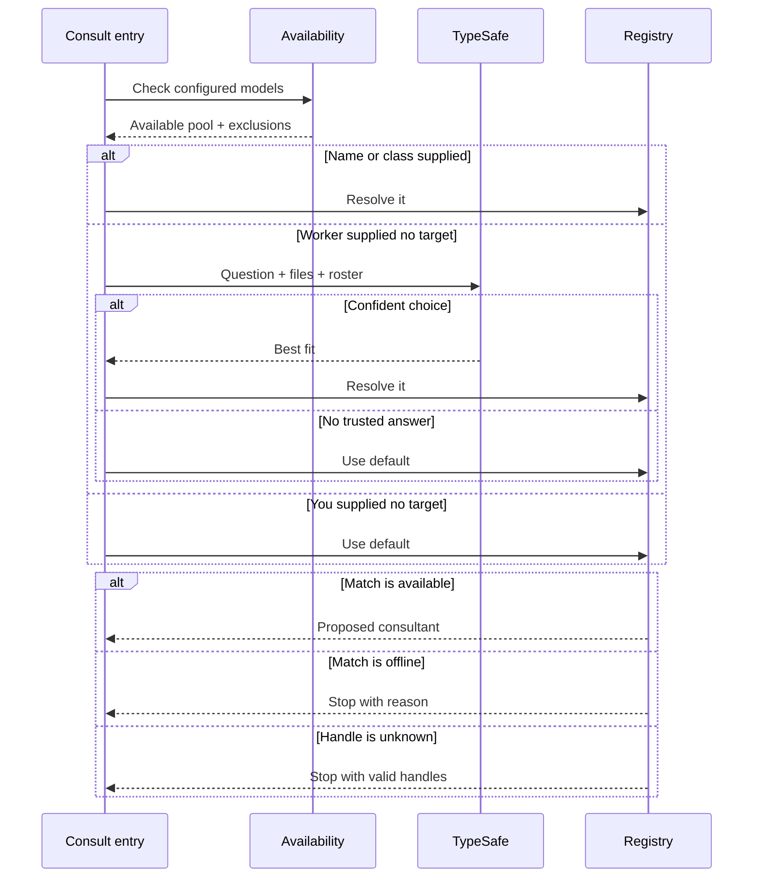
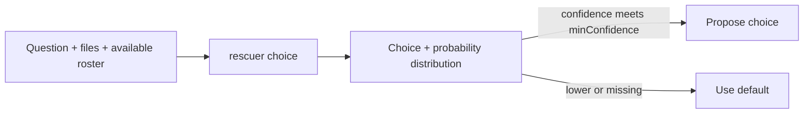

# Why did it choose that consultant?

The model name isn't the first decision. The real question is: which
*available* model can answer this well without wasting tokens?

**An explicit target wins. TypeSafe routes only when the worker leaves it blank.**

## How does a target win?



A name selects that registry entry. A class such as `vision` selects its
best carrier.

| What you supplied | What wins |
| --- | --- |
| Exact map key | That entry |
| Capability class | Best carrier |
| Nothing from the worker | TypeSafe, then the default |
| Nothing from `/consult` | The default |

Lower `rank` wins inside most classes. For `abliterated`, local comes
before hosted; `rank` breaks the remaining tie.

---

## What does TypeSafe classify?



<details>
<summary>Open the actual TypeSafe POST body</summary>

```jsonc
{
  "state": {
    "question": "Which model should review this cache design?",
    "context": "The local worker found a cross-provider invalidation risk.",
    "files": ["lib/cache.ts"],
    "models": {
      "qwen-27b": {
        "role": "local coding and research",
        "classes": ["local", "cheap"],
        "model": "llama.cpp/owner/qwen",
        "cost": "cheap (free/budget)",
        "guardrails": "permissive",
        "rank": 1
      },
      "grok-4.6": {
        "role": "hard debugging and planning",
        "classes": ["frontier", "intelligent"],
        "model": "xai/grok-4.6",
        "cost": "paid (frontier)",
        "guardrails": "strict — may decline policy-sensitive or high-risk security work; ordinary decompile-to-understand is fine",
        "rank": 1
      }
    }
  },
  "model": "jev-latest",
  "questions": {
    "rescuer": {
      "type": "choice",
      "instructions": "Pick the model in `models` whose role and classes best fit `question` (with `context` and `files`). The standing goal is to spend as few LLM tokens as possible: choose the cheapest model whose capabilities cover the need (classes cheap/fast/local first), and pick intelligent/frontier only when the problem genuinely demands it. Match capability tags to the question — e.g. a question about an image or screenshot needs a vision-classed model. Avoid strict-guardrail models when the content looks likely to trigger a refusal — NSFW/adult/sexual content (including image captions), or blackhat-borderline work (exploit payloads, protection bypass, malware, unauthorized access). Ordinary reverse engineering (decompile/disassemble to understand a binary, defensive analysis) stays on aligned models. Prefer an abliterated-class one only for the refusal cases; among those, prefer one also classed local over a hosted abliterated fallback. Weigh `history` when present — it is how past consults from this user actually went: prefer models the user picked over a proposal for similar tasks (`overridden_to`, `recent_user_choices`), avoid ones that refused, were overridden away, or were denied for similar work; counts under `same_worker` happened with the same `worker` model active as now and weigh more than the overall counts. `history.unexplored` lists models with no recorded outcomes yet: when the task is low-stakes (a quick review, summary, or second opinion — not critical debugging, not refusal-sensitive content) and an unexplored model's role and classes fit just as well, prefer it over an equally-fitting known model so its history can form; never pick an unexplored model when the stakes or a capability mismatch argue otherwise. When several fit equally, prefer the lower `rank` (1 = first choice).",
      "criteria": {
        "qwen-27b": "local coding and research",
        "grok-4.6": "hard debugging and planning"
      }
    }
  }
}
```

The dynamic values above are examples. The fields and classifier
instruction match the runtime payload. `question` stops at 1,200
characters; `context` stops at 400.

</details>

```json
{
  "model": "jev-1.13",
  "answers": {
    "rescuer": {
      "type": "choice",
      "choice": "qwen-27b",
      "probabilities": {
        "qwen-27b": 0.78,
        "grok-4.6": 0.22
      },
      "confidence": 0.78
    }
  }
}
```

TypeSafe returns the whole distribution. The choice must still exist in
the available pool and meet `judge.minConfidence`.

---

## How does routing learn from you?

The consult-log already records how every past consult went: user
overrides (proposed X, you picked Y), outright denials, and refusals. And
every record names the *worker* that was active at the time — because
preference is conditional: the rescuer you want under a 27B local worker
is not the one you want under a frontier main model.

`lib/route-history.ts` aggregates the recent months of that log and the
route node receives it as a `history` state field:

```jsonc
"history": {
  "worker": "llama.cpp/owner/qwen",           // active worker now
  "models": {
    "grok-4.6": {
      "consults": 12, "refused": 1,
      "overridden_away": 2, "overridden_to": 0, "denied": 1,
      "same_worker": { "consults": 8, "refused": 1, "overridden_away": 2, "overridden_to": 0, "denied": 0 }
    }
  },
  "unexplored": ["deepseek-flash"],           // configured, never consulted
  "recent_user_choices": [
    { "task": "summarize this pdf structure", "proposed": "xai/grok-4.6",
      "action": "override", "chose": "meta/muse-spark-1.3-contributor",
      "worker": "llama.cpp/owner/qwen" }
  ]
}
```

The judge does the generalizing — there is no hand-written task taxonomy.
`same_worker` counts are the ones from sessions with the same worker base
as now, and the instruction tells the judge those weigh more. Records are
aggregated by stable `provider/model` identity (registry keys are just
labels and get renamed), so history survives config renames and stale
entries age out. `/models` shows each consultant's remembered outcomes.

Outcome-learned routing has a known blind spot: a model that never gets
picked never builds history, so the router can never learn it. The
`unexplored` list closes it with targeted exploration — on a low-stakes
task where an unexplored model fits just as well, the judge is told to
give it the consult so its history can start forming. High-stakes and
refusal-sensitive work never explores.

The memory itself has two layers. The long-term baseline is the portable
calibration snapshot (`~/.pi/agent/calibration.json`) — old log records
fold into it as bounded counters behind a timestamp watermark. The live
layer is whatever the recent logs hold past that watermark. Copy the
snapshot to a new workstation and routing remembers you there;
`/calibration reset` forgets and relearns from today.

Same data, three horizons: this in-context loop makes today's routing
reflect past outcomes, the snapshot keeps that memory compact and
portable, and the judge trace (`judge-YYYY-MM.jsonl`) remains the offline
dataset for eventually training your own routing head.

---

## How do you describe a model?

```jsonc
{
  "models": {
    "grok-4.6": {
      "provider": "xai",
      "model": "grok-4.6",
      "role": "hard debugging and planning",
      "classes": ["frontier", "intelligent"],
      "rank": 1
    }
  }
}
```

| Field | What routing learns |
| --- | --- |
| `role` | When this model helps |
| `classes` | Which handles and capabilities it owns |
| `rank` | How it wins ties |
| `prescreen` | Whether strict-model limits matter |

Class `default` marks the no-target fallback. Without one, the best-ranked
available entry wins.

---

## What if the target is offline?

Pi health-checks `llama.cpp` entries. It assumes cloud entries are
reachable because probing them would spend credentials or quota.

An explicit offline target stops with its reason. **Routing never swaps
your explicit choice behind your back.**

The request log keeps the proposal, final model, selection source,
confidence, and availability exclusions.

Implementation: `lib/config.ts`, `lib/availability.ts`, and
`extensions/advisor.ts`.

Next: [why Pi asks for approval](consultation-approval.md).
