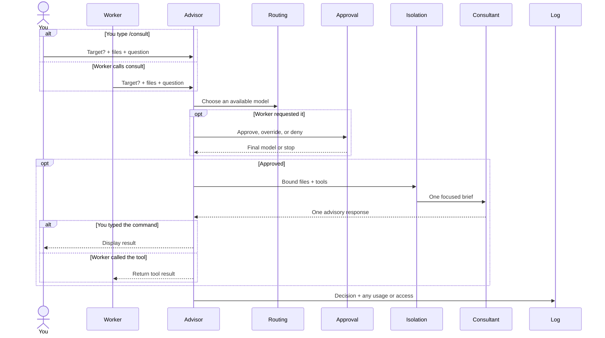

# Consultation

Your worker is stuck, but replacing it would throw away the loop it
already owns. A consultation asks one specialist one question, then gives
control back.

**The specialist advises. Your worker still owns the task.**

## What happens?

You might expect the advisor to be one big gate. It isn't. Model choice,
permission, and file access fail for different reasons, so each gets its
own boundary.

---

## Which decision confused you?

| Your question | Follow this branch |
| --- | --- |
| Why this model? | [Routing and availability](consultation-routing.md) |
| Why did Pi ask me? | [Approval](consultation-approval.md) |
| What could the model read? | [Isolation and execution](consultation-isolation.md) |
| Why did it stop before launch? | [Pre-screen](consultation-prescreen.md) |

The TypeSafe-backed branches show the real POST body, a representative
response, and the threshold that turns probability into action.

Verbatim payloads keep classifier terminology intact. The surrounding
prose uses neutral labels so you can scan it without noise.

---

## What never changes?

The consultant gets one bounded, read-only brief. It can't mutate your
workspace or continue its own session.

Implementation: `extensions/advisor.ts`.

**Follow the branch that answered “why?” and stop there.**
