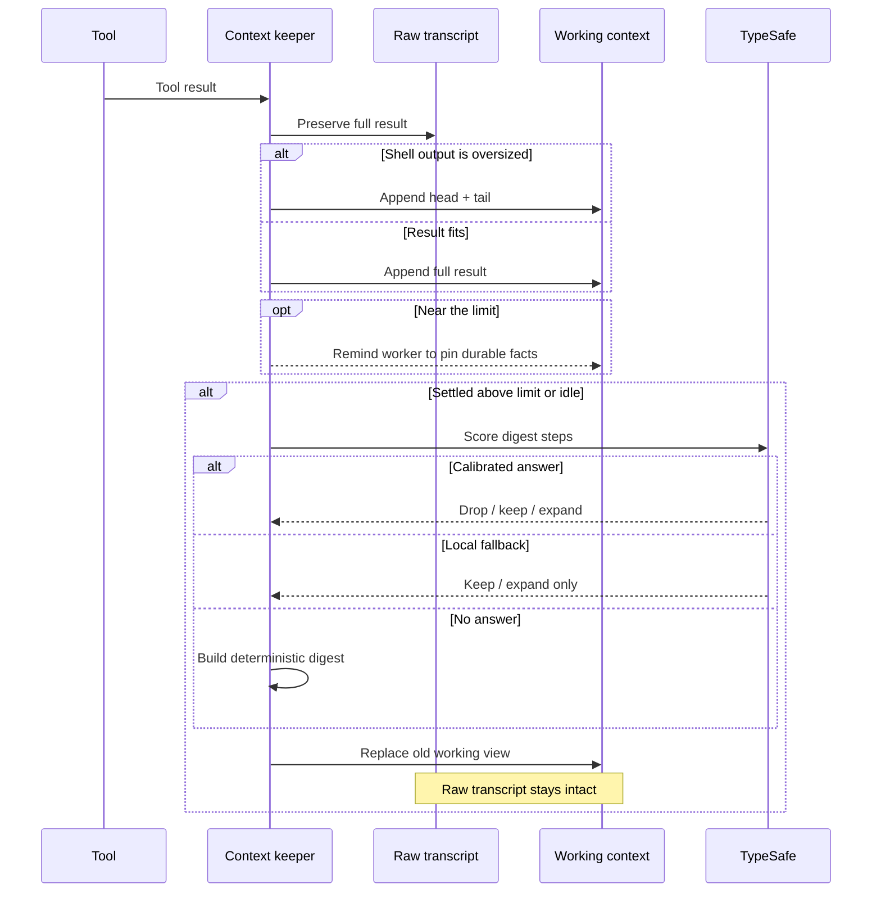
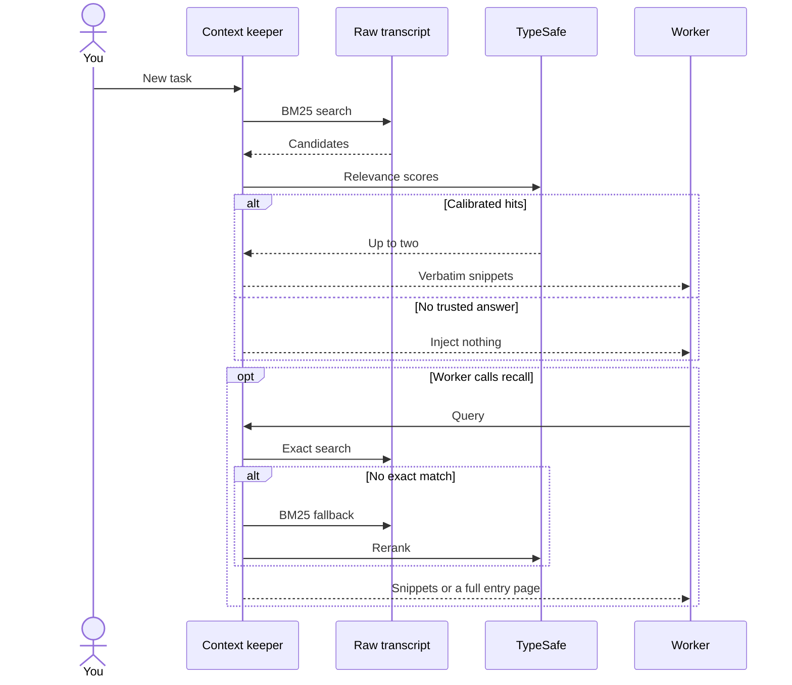

# How can old context disappear without being lost?

Your transcript can be true and still be too large to send. The context
keeper separates what happened from what the worker sees now.

**Compaction changes the working view. It never rewrites the raw transcript.**

## What enters the working context?



Large shell output gets trimmed once. Its full text enters a hidden
session record before the working copy becomes a head-and-tail excerpt.

User messages never become digest-drop candidates.

---

## How do old facts come back?



Exact search wins when the worker remembers a phrase. BM25 catches a
paraphrase; TypeSafe removes confident noise without emptying the list.

You might think a generated summary is enough. It isn't when the missing
fact is one command flag, error line, or user constraint, so recall
returns verbatim text.

---

## Which part owns which promise?

| Part | Promise |
| --- | --- |
| Ingestion pruner | Trim once and preserve the full shell result |
| `note` | Pin a short decision or invariant verbatim |
| Pre-cut reminder | Ask for durable notes before compaction |
| Arc digest | Keep a deterministic step skeleton |
| Digest judge | Score non-user steps as drop, keep, or expand |
| Memory gate | Inject at most two calibrated history snippets |
| `recall` | Search exact text, then BM25, then page full entries |

An uncalibrated fallback may expand a digest. It can't delete a step or
inject memory.

---

## Which compaction mode should you pick?

| Mode | What it does | Pick it when |
| --- | --- | --- |
| `arc` | Builds a deterministic digest with optional scoring | You want the local-first default |
| `checkpoint` | Asks a model for a structured handoff | Narrative continuity earns the latency |
| `off` | Leaves compaction to Pi | The provider needs no local tuning |

Arc keeps pinned notes, user asks, terse actions, and recoverable tool
stubs. Old lines leave first when the budget fills.

Checkpoint mode reuses the session prefix and rejects any result that
doesn't shrink the replaced span.

---

## Why does cache shape this design?

Keeper-managed sessions come from a registered model's `local` class,
then `context.providers` for unregistered models.

A cache miss over a large local prompt can cost minutes. Hybrid recurrent
models also roll back to their nearest saved checkpoint when rendered
history changes.

Keep fallback inference on another server and use dense llama.cpp
checkpoints. [Local Qwen](local-qwen.md) shows the setup.

---

## How do you configure it?

```jsonc
{
  "context": {
    "providers": ["llama.cpp", "lmstudio", "ollama"],
    "mode": "arc",
    "compactAtTokens": 60000,
    "idleCompactMinutes": 5,
    "recall": true,
    "rerank": true,
    "judgeDigest": true,
    "memory": true,
    "notes": true,
    "reminderTokens": 8000,
    "pruner": true,
    "prunerThresholdChars": 6000,
    "prunerHeadChars": 1500,
    "prunerTailChars": 1500,
    "summarizer": "qwen-27b",
    "maxTokens": 4096
  }
}
```

`summarizer` and `maxTokens` affect checkpoint mode only.

---

## Where did these choices come from?

| Finding | What geocine-pi took from it |
| --- | --- |
| [ARC](https://www.alphaxiv.org/abs/2607.25066) | Deterministic recall beats paraphrase-heavy compaction |
| [TokenPilot](https://www.alphaxiv.org/abs/2606.17016) | Trim tool output at ingestion to preserve prefix caches |
| [Raw-log search](https://www.alphaxiv.org/abs/2608.12888) | Keep the transcript as memory |
| [Interaction cost](https://www.alphaxiv.org/abs/2608.16370) | Restore full entries to prevent repeated tool work |
| [Zero-Mem](https://www.alphaxiv.org/abs/2607.29377) | Use BM25 and a classifier gate without worker tokens |
| [Referential dangling](https://www.alphaxiv.org/abs/2608.04569) | Score the whole digest, not detached facts |
| [ACM](https://www.alphaxiv.org/abs/2607.23809) | Compact early to keep a small active set |

Every compaction records its trigger, size, outcome, and latency. Recall
after compaction shows what the digest failed to keep.

Implementation: `extensions/context-keeper.ts`.

**Keep the transcript exact. Let the working view stay small.**
