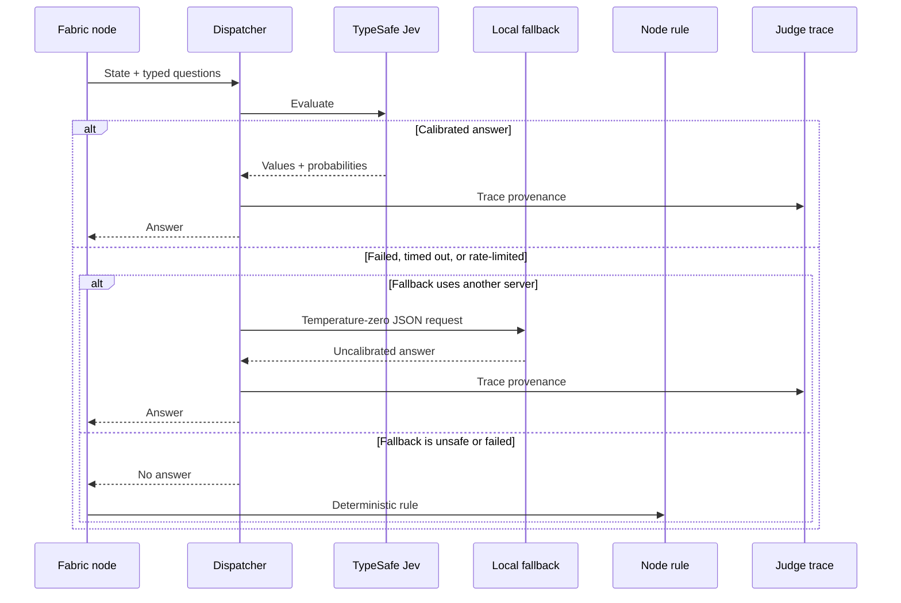
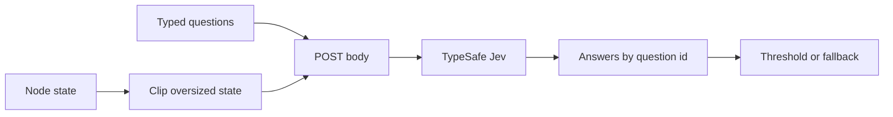

# How does a probability become an action?

Not every decision deserves another chat turn. The decision fabric asks
small typed questions before Pi spends tokens, changes context, blocks a
call, or switches models.

**TypeSafe answers first. Every node still has a deterministic way out.**

## How does one judgment travel?



“Calibrated” means the returned probabilities are fit for threshold
decisions. A local fallback can still help, but Pi treats its confidence
as weaker evidence.

---

## What goes over the wire?

```http
POST https://api.typesafe.ai/v1/systemone
Content-Type: application/json
Authorization: Bearer <TYPESAFE_API_KEY>
```

```jsonc
{
  "state": {},
  "model": "jev-latest",
  "questions": {}
}
```



There is no hidden chat prompt in this tier. The node builds `state` and
`questions`; the backend adds `model` and posts the JSON.

The API key stays in the header. It never enters the body or trace.

Open a real node payload:

- [consult routing](consultation-routing.md#what-does-typesafe-classify);
- [consult approval](consultation-approval.md#what-does-typesafe-classify);
- [consult pre-screen](consultation-prescreen.md#what-does-typesafe-classify).

---

## Why are there three tiers?

| Tier | What you gain | What it costs |
| --- | --- | --- |
| TypeSafe | Calibrated probabilities in one parallel call | A remote key and rate budget |
| Local fallback | Free answers in the same schema | Self-reported confidence |
| Node rule | Zero latency and permanent availability | Narrow behavior |

The local fallback is disabled when it shares the active worker's host
and port. On a one-slot server, that side request would evict the worker's
cache.

---

## What can the fabric decide?

| Node | Question | Read the flow |
| --- | --- | --- |
| `triage` | Where should this task or follow-up run? | [Triage](triage.md) |
| `route` | Which consultant fits at the lowest cost? | [Routing](consultation-routing.md) |
| `approve` | Can this consult run without asking you? | [Approval](consultation-approval.md) |
| `prescreen` | Will a strict target probably refuse? | [Pre-screen](consultation-prescreen.md) |
| `watchdog` | Is the worker healthy, stuck, drifting, or ready to escalate? | [Runtime control](runtime-control.md) |
| `gate` | Is the work done? | [Runtime control](runtime-control.md) |
| `guard` | Does this command serve the task or create collateral risk? | [Runtime control](runtime-control.md) |
| `tool-guard` | Is this retry useful or wasteful? | [Runtime control](runtime-control.md) |
| `compact` | Which digest steps stay? | [Context](context.md) |
| `notes` | Which pinned notes became stale? | [Context](context.md) |
| `memory` | Is old history worth injecting? | [Context](context.md) |
| `recall` | Which transcript hit answers the query? | [Context](context.md) |

---

## Which answers may change context?

Routing, recall reranking, and call blocking may use an uncalibrated
answer as a better heuristic.

Memory injection and digest deletion require a calibrated answer.
**Uncertain classification can't silently rewrite the worker's premises.**

---

## How do you configure it?

```jsonc
{
  "judge": {
    "enabled": true,
    "provider": "typesafe",
    "baseUrl": "https://api.typesafe.ai",
    "model": "jev-latest",
    "apiKeyEnv": "TYPESAFE_API_KEY",
    "maxInputTokens": 32000,
    "timeoutMs": 4000,
    "minConfidence": 0.55,
    "maxCallsPerMinute": 30,
    "trace": true,
    "fallback": {
      "baseUrl": "http://127.0.0.1:8081/v1",
      "model": "qwen3-4b",
      "maxTokens": 500
    }
  }
}
```

OpenRouter also works through
`https://openrouter.ai/api/alpha/decisions` with
`~typesafe/jev-latest`.

---

## What can you inspect?

`/geocine judge` shows calls, fallbacks, degraded decisions, and latency
for each node.

Each answered call appends `{context, schema, labels, source, elapsedMs}`
to `judge-YYYY-MM.jsonl`. The local fallback consumes the same
representation, which keeps training and inference aligned.

Implementation: `lib/judge/`.

Next: [turn those traces into training rows](training-data.md).
