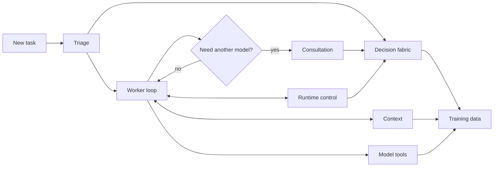

# Pick the part that surprised you

You don't need to learn geocine-pi in order. Start with the moment that
made you ask, “Why did it do that?”

## What are you trying to understand?

| What you noticed | Read this |
| --- | --- |
| The active model changed, stayed, or returned | [Triage and model leases](triage.md) |
| Another model was proposed or contacted | [Consultation](consultation.md) |
| TypeSafe answered, failed, or fell back | [Decision fabric](decision-fabric.md) |
| A call was blocked or the worker got a nudge | [Runtime control](runtime-control.md) |
| Old context disappeared or came back | [Context management](context.md) |
| A model saw unfamiliar tool names | [Model harness and tools](model-tools.md) |
| Shell output, pacing, timing, or menus changed | [Runtime operations](operations.md) |
| You want to train from past decisions | [Training data](training-data.md) |
| A local model went cold after a hop | [Local Qwen](local-qwen.md) |
| You already know the setting name | [Configuration reference](configuration.md) |

**Pick one row. You can ignore the rest until the system surprises you again.**
