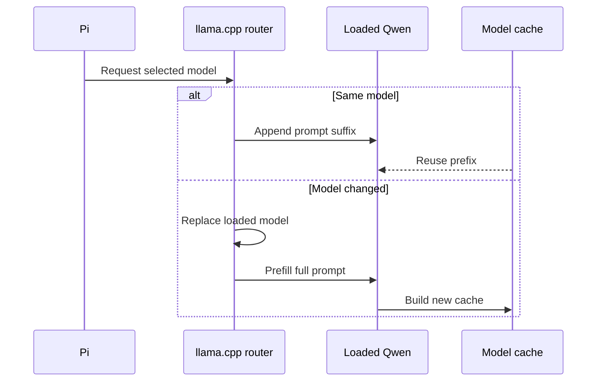

# Why does a local model go cold after a hop?

One model slot buys a large warm cache. A hop spends it.

**KV state can't move between models, so the next model must build its own prefix.**

## How do you launch the server?

```sh
llama-server --no-models-autoload --models-max 1 --host 127.0.0.1 --port 8080 -np 1 -ngl 99 \
  -c 262144 -fa on --cache-type-k q4_0 --cache-type-v q4_0 \
  --ctx-checkpoints 64 --checkpoint-min-step 2048 --jinja
```

This setup runs a llama.cpp model router on `127.0.0.1:8080`. It keeps
one active Qwen model and gives that session the largest practical cache.

---

## When does the cache hit?



You might expect the router to keep both caches. `--models-max 1` trades
that flexibility for bounded VRAM and a larger cache for the active
session.

---

## Why use these flags?

| Flag | What it buys |
| --- | --- |
| `-np 1` | One large cache for the active session |
| `--models-max 1` | Bounded VRAM; model hops start cold |
| `--ctx-checkpoints 64 --checkpoint-min-step 2048` | Dense rollback points for Qwen3.8 recurrent state |
| `-c 262144` | The full window; context keeper limits the working set |
| `-fa on` | Flash attention |
| `--cache-type-k q4_0 --cache-type-v q4_0` | Smaller KV memory |
| `-ngl 99` | GPU layers when memory permits |
| `--jinja` | The chat template expected by the Qwen harness |
| `--no-models-autoload` | Explicit model loading |

---

## Why do checkpoints matter?

Qwen3.8 removes prior `<think>` blocks when it renders history again.
That prefix change can roll recurrent state back to an older checkpoint.

Dense checkpoints and early compaction bound the text that must be
ingested again.

Run judge or watchdog fallback inference on another server, such as
`:8081`. Sharing `:8080` would evict the worker cache.

Sampling can stay client-controlled or use Qwen's defaults:
`--temp 1 --top-p 0.95 --top-k 20 --min-p 0`.

Implementation: `extensions/models/qwen.ts`.

Next: [see why triage dwells after a hop](triage.md#should-the-next-turn-stay-there).
