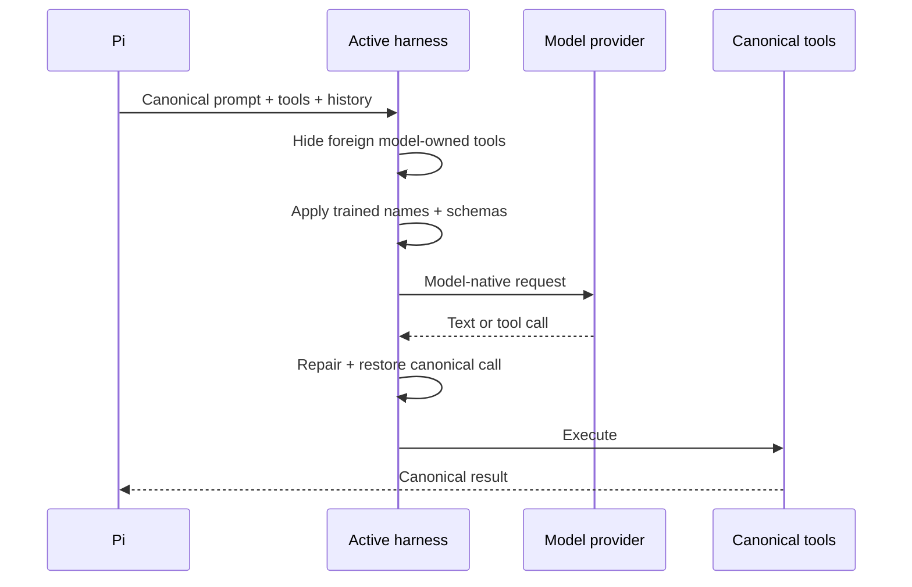
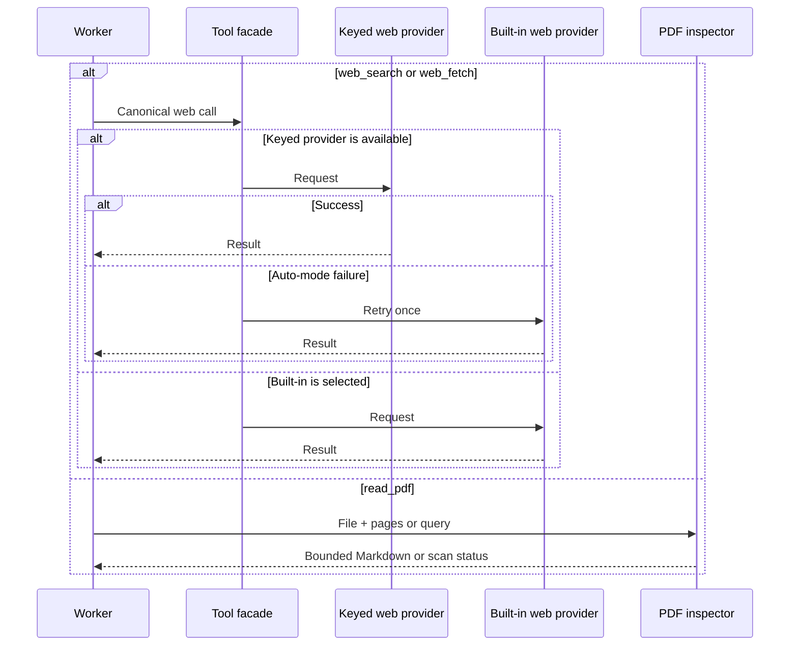
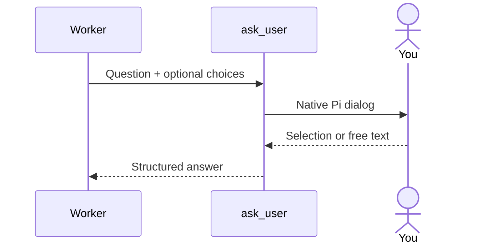

# Why does each model see different tool names?

A model can know how to use a shell and still fail because training called
it `exec_command` while Pi calls it `bash`.

**The harness translates at the provider boundary. Pi keeps one canonical tool history.**

## Where does translation happen?



The model sees the dialect it learned. The transcript stores the stable
Pi form, so changing models doesn't rewrite history or invalidate a
prefix for cosmetic reasons.

---

## Which dialect does each family see?

| Family | Model sees | Pi executes |
| --- | --- | --- |
| Qwen | `read_file`, `write_file`, `run_shell_command`, `grep_search`, `glob`, `list_directory`, `todo_write` | `read`, `write`, `bash`, `grep`, `find`, `ls`, `todo` |
| Grok | `run_terminal_command`, `read_file`, `search_replace`, `list_dir`, `todo_write` | `bash`, `read`, `edit`, `ls`, `todo` |
| OpenAI | `exec_command`, `apply_patch`, `update_plan`, `view_image` | canonical shell, patch, todo, and image handling |
| DeepSeek | `bash` (`timeoutMs`, `workdir`), `read`/`write`/`edit` on `file_path`, `glob`, `grep` (`include`), `todo_write`, `ask_user_question`, `web_search` (`queries[]`) | `bash`, `read`, `write`, `edit`, `find`, `grep`, `todo`, `ask_user`, `web_search` |

Qwen also repairs leaked XML calls and llama.cpp schema quirks. OpenAI
gets native multi-file `apply_patch`. DeepSeek's dialect comes from its
first-party harness (`dsh`): mostly canonical names with trained
parameter spellings.

The shared todo state survives model changes and compaction.

---

## What happens to web and PDF calls?



`web.provider: "auto"` prefers TinyFish when configured, then retries
with Pi's built-in provider. A pinned provider reports its own error.

`read_pdf` extracts text by page, supports ranges and search, and names
pages omitted by the output budget. It reports scanned pages instead of
inventing OCR text.

---

## How does the worker ask you something?



The harness maps Qwen and Grok's multi-question envelope onto one native
Pi question. The model doesn't need a file-based workaround.

---

## How do you configure the boundary?

```jsonc
{
  "harness": {
    "aliases": true
  },
  "qwen": {
    "auto": true,
    "level": "medium",
    "imageLevel": "low"
  },
  "web": {
    "provider": "auto"
  },
  "pdf": {
    "maxChars": 24000,
    "maxSearchMatches": 40
  }
}
```

| Command | What it changes |
| --- | --- |
| `/harness` | Shows the active model family |
| `/harness auto` | Toggles Qwen per-turn thinking |
| `/harness <level>` | Sets Qwen's thinking budget |
| `/harness image <level\|inherit>` | Sets image-turn thinking |

Implementation: `extensions/models/`, `extensions/ask-user.ts`, and
`extensions/pdf-reader.ts`.

Next: [see how stable history protects cache](context.md).
