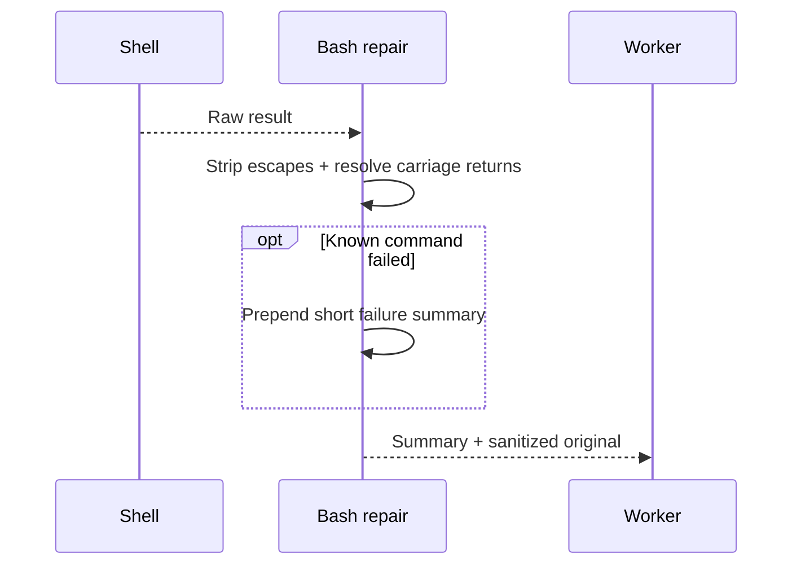
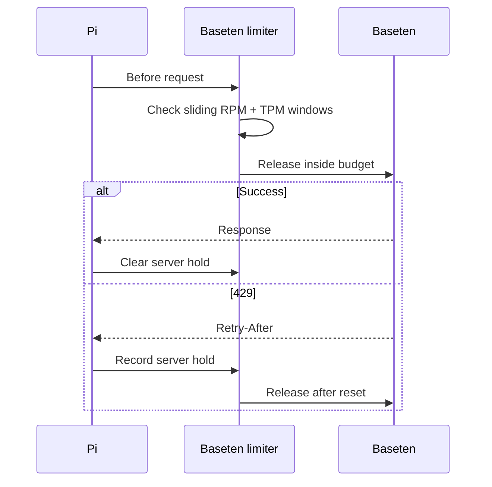
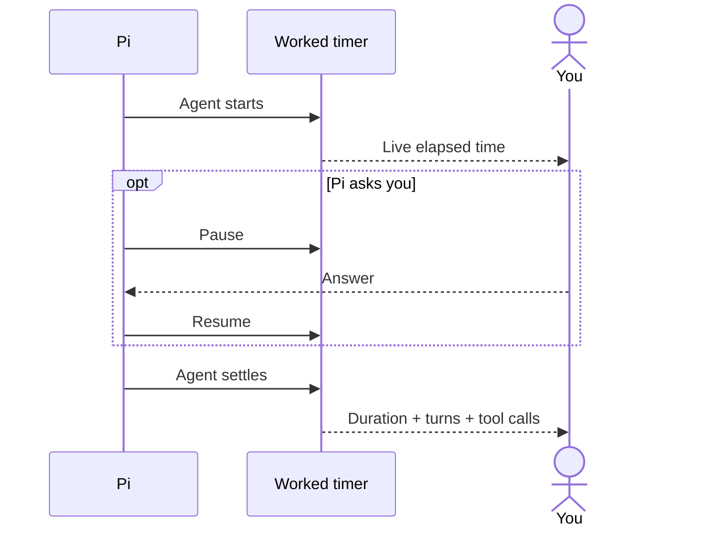
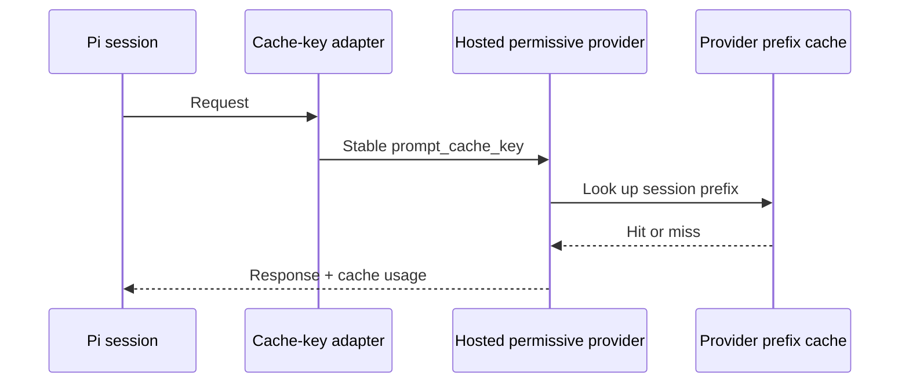
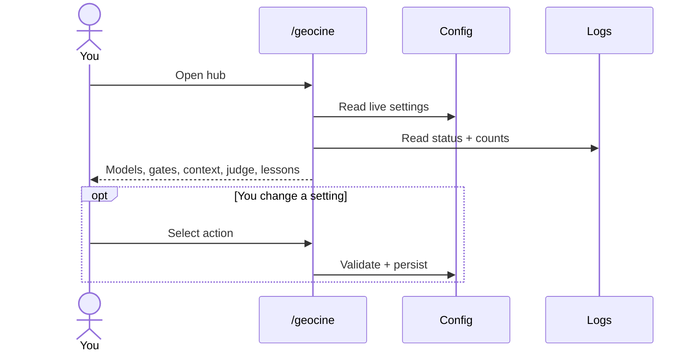

# What happens around the reasoning loop?

The worker shouldn't have to reason around terminal escape codes, rate
windows, cache affinity, or a stopwatch.

**Small boundary adapters handle those chores without changing the worker's plan.**

## Why did shell output change?

Go, Cargo, pytest, Python tracebacks, and Node get compact failure
summaries. Successful or unknown output only gets sanitized.

---

## Why did a Baseten request wait?

The defaults leave headroom below the basic limits:
`BASETEN_RPM=14` and `BASETEN_TPM=90000`.

Environment variables replace both values.

---

## What does the timer count?

Human wait time doesn't count as agent work. Runs under five seconds
update the footer without adding a notification.

---

## Can a hosted hop keep its prefix warm?

The stable key improves backend affinity for `abliteration-ai`. It can't
move cache state between different models.

**A cache key improves your chance of a hit; it doesn't make caches portable.**

---

## What can `/geocine` change?

Most config is reread on events, so menu changes don't need a reload.

---

## Why aren't these one subsystem?

| Adapter | Boundary it owns |
| --- | --- |
| `bash-repair` | Shell result entering context |
| `baseten-limits` | Baseten request timing |
| `worked-timer` | Interactive elapsed time |
| `abliteration-cache` | Hosted prefix affinity |
| `geocine-menu` | Your config and status UI |

They sit on unrelated boundaries. Combining them would couple provider,
UI, and transcript behavior without helping the worker.

Implementation: `extensions/bash-repair.ts`,
`extensions/baseten-limits.ts`, `extensions/worked-timer.ts`,
`extensions/abliteration-cache.ts`, and `extensions/geocine-menu.ts`.

Next: [inspect every setting](configuration.md).
