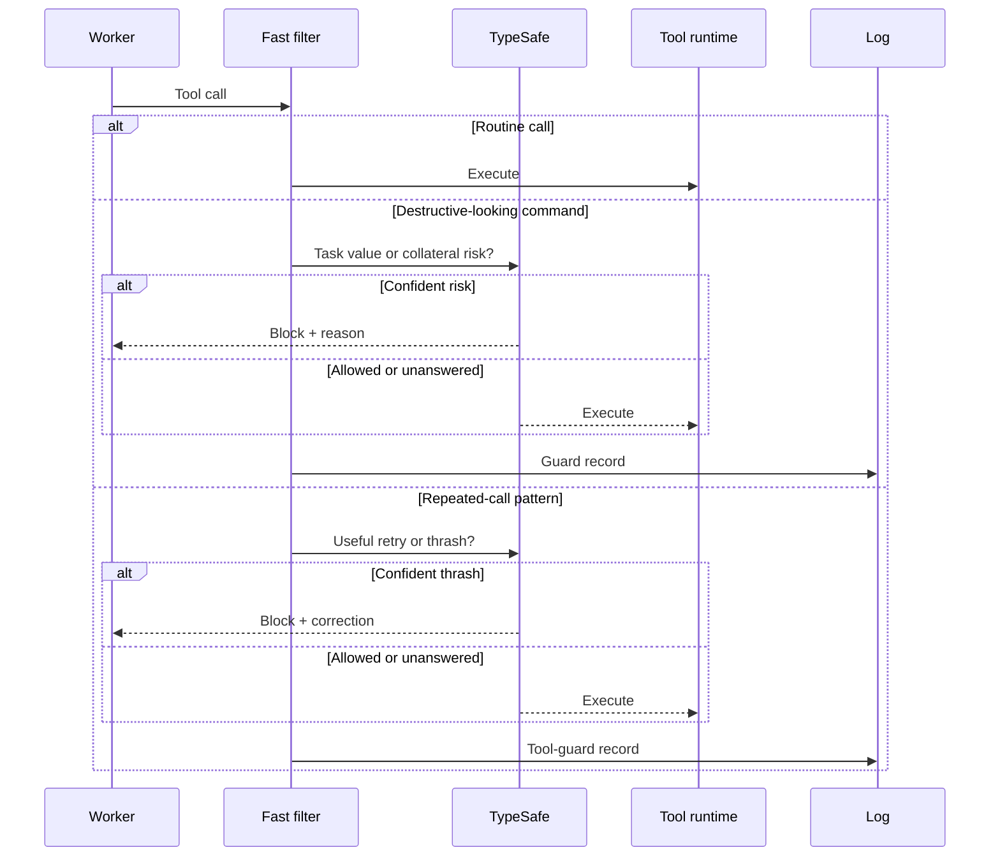
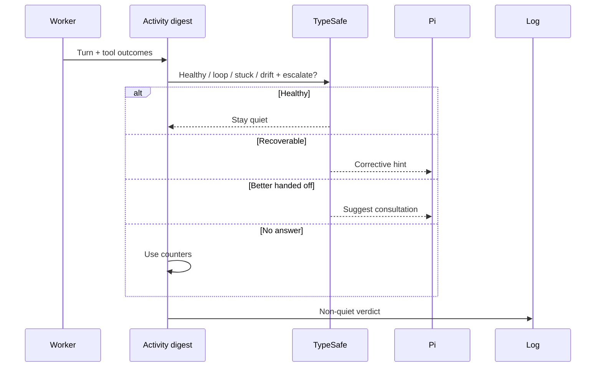
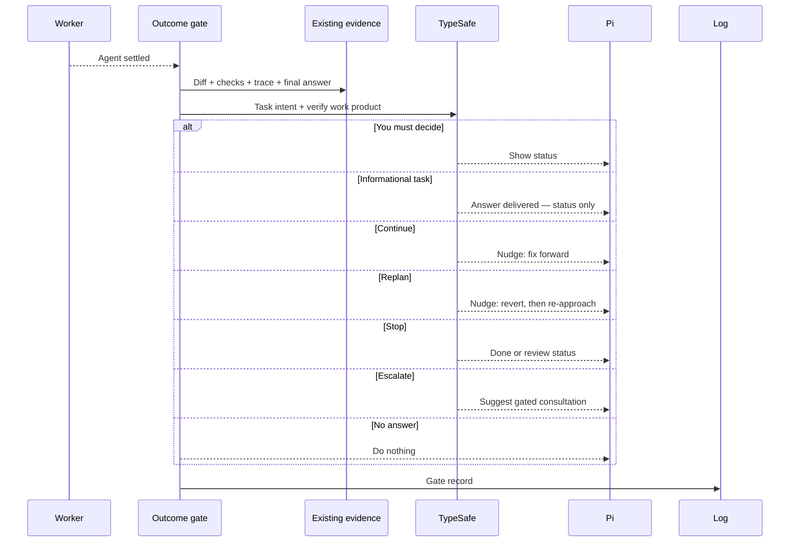

# When does Pi interrupt the worker?

A worker can fail at three timescales: one bad call, a bad loop, or a bad
final answer. One detector can't see all three.

**Guards watch calls. The watchdog watches motion. The gate watches the result.**

| Layer | Evidence | Possible action |
| --- | --- | --- |
| Guards | One command or repeated tool call | Allow or block |
| Watchdog | Recent turns and tool outcomes | Stay quiet, correct, or suggest a consult |
| Outcome gate | Diff, checks, trace, and session stage | Continue, replan, stop, escalate, or wait for you |

## Is this call harmful or wasteful?



Routine calls never reach TypeSafe. The tool guard wakes after two same
calls, an unchanged failed retry, or a fourth read of one file.

An edit or another state change resets that suspicion because the retry
may now be valid.

---

## Is the loop going nowhere?



Counters catch repeats and failure streaks. TypeSafe catches drift and
grinding that don't share a mechanical pattern.

---

## Is the work actually done?



The gate reads evidence the worker already produced. It doesn't run tests
or builds.

Its parallel checks look for regressions, scope creep, architecture
changes, missing tests, and decisions that belong to you.

---

## What if the run made things worse?

Recovery isn't binary. A failed run can be **almost right** (fix
forward) or **actively wrong** (checks regressed from passing to failing
while the diff kept growing). Patching on top of the second kind digs
the hole deeper.

That's why `replan` is its own verdict, not advice glued onto
"continue". A replan nudge tells the worker: **revert to the last good
state first, then re-approach fresh.** Research on coding-agent
recovery backs the split — fix-forward, fresh-start, and escalate
succeed on different failures, and no single default wins.

---

## What if you only asked a question?

Ask "what do you think about my repo?" and there's nothing to diff. An
earlier gate read that empty diff as unfinished work and nudged the
worker to continue — so it invented changes nobody asked for.

The gate now anchors on your starting intent. A `wants_changes` check
reads the task as you wrote it, and the worker's final answer counts as
evidence. **An informational ask is done when the answer lands — the
gate never auto-nudges it into making changes.**

One more trap is closed: a nudge arrives looking like a user message.
Nudges and hints from extensions no longer re-anchor the task or refill
the nudge budget. **`maxNudgesPerTask` is a real cap, not a suggestion.**

---

## How do you know the judge is right?

The thresholds only work if the probabilities behind them mean
something. Two things keep them honest.

**Anchors instead of bare scores.** Small classifiers compare better
than they scale, so the gate's questions carry worked examples: "'fix
the failing test' + empty diff = not done". The judge matches against
anchors instead of inventing an absolute scale each call.

**`/calibration` shows the receipts.** Every nudge gets an outcome: the
next verdict for the same task says whether it resolved, stalled, or
never re-settled (`nudgesBefore` joins them). Every unsure approval gets
one too: the approve node's probability sits next to what you then
decided. The report bins these by confidence.

**If high-confidence decisions don't succeed more often than
low-confidence ones, the confidence is noise** — raise
`judge.minConfidence` or stop trusting auto-approval. If they do, the
thresholds can come down and the fabric earns more autonomy.

---

## How do you tune the three layers?

```jsonc
{
  "watchdog": {
    "enabled": true,
    "judgeEveryTurn": true,
    "sendHints": true,
    "hintCooldownTurns": 4,
    "loopThreshold": 3,
    "failStreakThreshold": 3
  },
  "guard": {
    "enabled": true,
    "blockThreshold": 0.8
  },
  "toolGuard": {
    "enabled": true,
    "blockThreshold": 0.8,
    "maxBlocksPerTask": 3
  },
  "gate": {
    "enabled": true,
    "maxNudgesPerTask": 1,
    "maxDiffChars": 8000
  }
}
```

You can run an optional watchdog LLM on another server through
`watchdog.baseUrl`. Don't point it at the active one-slot worker server;
the side request would evict the worker cache.

Cooldowns and caps stop the control layer from becoming its own loop.
Pi's native tool approval remains the final permission boundary.

---

## What gets recorded?

| Record | Evidence you can inspect |
| --- | --- |
| `guard` | Command, task, risk, blocked |
| `tool_guard` | Tool, call, trigger, waste probability, blocked |
| `watchdog` | Digest, tier, verdict, confidence |
| `gate` | Task intent, done probability, verdict (continue/replan/stop/escalate), diff stat, checks, review flags, nudges before |

Implementation: `extensions/command-guard.ts`,
`extensions/tool-guard.ts`, `extensions/watchdog.ts`,
`extensions/outcome-gate.ts`, and `extensions/calibration.ts` (the
`/calibration` report, analysis in `lib/calibration.ts`).

Next: [see how every judgment degrades safely](decision-fabric.md).
