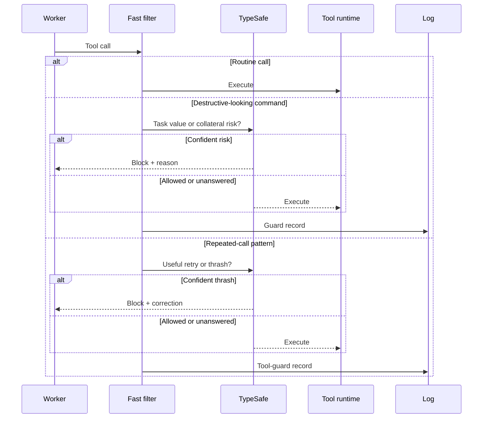
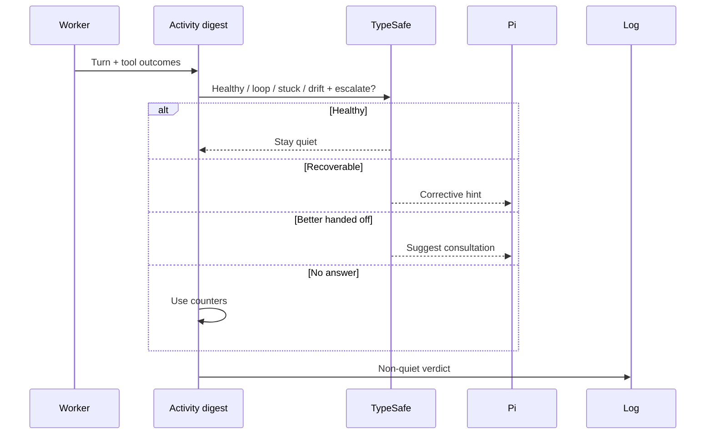
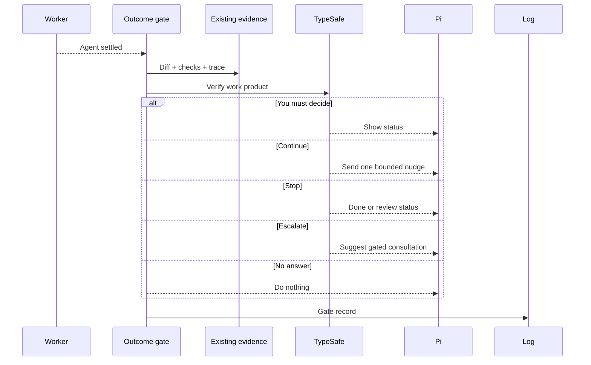

# When does Pi interrupt the worker?

A worker can fail at three timescales: one bad call, a bad loop, or a bad
final answer. One detector can't see all three.

**Guards watch calls. The watchdog watches motion. The gate watches the result.**

| Layer | Evidence | Possible action |
| --- | --- | --- |
| Guards | One command or repeated tool call | Allow or block |
| Watchdog | Recent turns and tool outcomes | Stay quiet, correct, or suggest a consult |
| Outcome gate | Diff, checks, trace, and session stage | Continue, stop, escalate, or wait for you |

## Is this call harmful or wasteful?



Routine calls never reach TypeSafe. The tool guard wakes after two same
calls, an unchanged failed retry, or a fourth read of one file.

An edit or another state change resets that suspicion because the retry
may now be valid.

---

## Is the loop going nowhere?



Counters catch repeats and failure streaks. TypeSafe catches drift and
grinding that don't share a mechanical pattern.

---

## Is the work actually done?



The gate reads evidence the worker already produced. It doesn't run tests
or builds.

Its parallel checks look for regressions, scope creep, architecture
changes, missing tests, and decisions that belong to you.

---

## How do you tune the three layers?

```jsonc
{
  "watchdog": {
    "enabled": true,
    "judgeEveryTurn": true,
    "sendHints": true,
    "hintCooldownTurns": 4,
    "loopThreshold": 3,
    "failStreakThreshold": 3
  },
  "guard": {
    "enabled": true,
    "blockThreshold": 0.8
  },
  "toolGuard": {
    "enabled": true,
    "blockThreshold": 0.8,
    "maxBlocksPerTask": 3
  },
  "gate": {
    "enabled": true,
    "maxNudgesPerTask": 1,
    "maxDiffChars": 8000
  }
}
```

You can run an optional watchdog LLM on another server through
`watchdog.baseUrl`. Don't point it at the active one-slot worker server;
the side request would evict the worker cache.

Cooldowns and caps stop the control layer from becoming its own loop.
Pi's native tool approval remains the final permission boundary.

---

## What gets recorded?

| Record | Evidence you can inspect |
| --- | --- |
| `guard` | Command, task, risk, blocked |
| `tool_guard` | Tool, call, trigger, waste probability, blocked |
| `watchdog` | Digest, tier, verdict, confidence |
| `gate` | Done probability, route, diff stat, checks, review flags |

Implementation: `extensions/command-guard.ts`,
`extensions/tool-guard.ts`, `extensions/watchdog.ts`, and
`extensions/outcome-gate.ts`.

Next: [see how every judgment degrades safely](decision-fabric.md).
