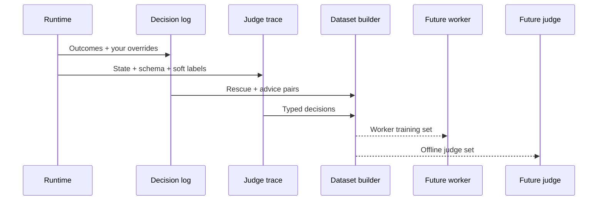
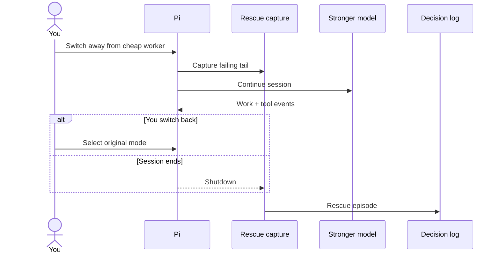

# Which logs can teach the system?

A log line isn't training data because it exists. A useful row connects
what the system saw, what it chose, and what happened next.

**Human corrections and real outcomes outrank classifier guesses.**

## How does a decision become a dataset row?



Nothing from these files enters a future prompt automatically. You must
promote a lesson yourself.

---

## What does the decision log remember?

`~/.pi/agent/consult-log/YYYY-MM.jsonl` is append-only. One correlation id
connects a consultation or incident across its records.

| Signal | What it can teach |
| --- | --- |
| `approval: "user_no"` | The system shouldn't have consulted |
| `chosenBy: "user_override"` | The proposed model was wrong |
| `refusalSuspected` | The pre-screen missed or confirmed a limit |
| Brief → advice | A local model can imitate specialist reasoning |
| Watchdog digest → outcome | When to recover or escalate |
| Triage route + transition | Hardness, refusal risk, hop, dwell, or return |
| Gate verdict | Whether the work was done |
| Guard and tool-guard verdicts | Risky commands and wasteful calls |
| Staged files → files read | Whether the brief carried useful context |
| Compaction record | What triggered compression and how much it saved |

`/geocine log` shows this month's counts.

---

## What does one judge trace look like?

```json
{
  "ts": "...",
  "node": "gate",
  "source": "jev",
  "elapsedMs": 240,
  "context": "<serialized state>",
  "schema": {
    "done": {
      "type": "boolean",
      "description": "..."
    }
  },
  "labels": {
    "done": {
      "value": "true",
      "prob": 0.93,
      "probs": {}
    }
  }
}
```

With `judge.trace` enabled, every answered fabric call appends this shape
to `judge-YYYY-MM.jsonl`.

`context` is what the judge saw. `schema` is the typed question.
`labels` keeps the answer and its probability mass.

Noul questions become booleans; choice and score questions become enums.
The local fallback consumes the same serialization, so training and
inference don't drift into different formats.

`source` separates calibrated `jev` rows from weaker `naive-llm` rows.
You can filter or down-weight the weaker labels later.

---

## Where do rescue episodes come from?



Live capture starts when you switch from a cheap or local worker to a
stronger model. It ends when you switch back or close the session.

The row keeps the failing tail, rescuer tool events, touched files, and
final summary.

You can also mine model changes from old session JSONL:

```bash
node scripts/mine-rescues.mjs
node scripts/mine-rescues.mjs --out rescues.jsonl --min-actions 2
```

Each line pairs `failure_context` with `rescue_trajectory`. The switch
itself labels the moment when the cheaper worker needed help.

---

## How does one rescue become a lesson?

```markdown
# <short imperative title>
**When:** <recognizable symptom>
**Do:** <approach that worked>
**Why the naive approach fails:** <one sentence>
```

`/distill` turns the latest rescue into a draft under
`~/.pi/agent/rescue-lessons/`.

Draft status matters. The lesson stays out of prompts until you promote it
into `AGENTS.md` or a skill through `/geocine lessons`.

Implementation: `extensions/rescue.ts`, `lib/consult-log.ts`, and
`lib/judge/serialize.ts`.

**Logs become useful when outcomes can correct the decision that produced them.**
