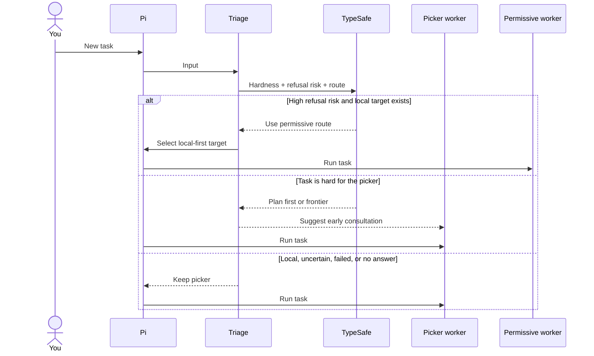
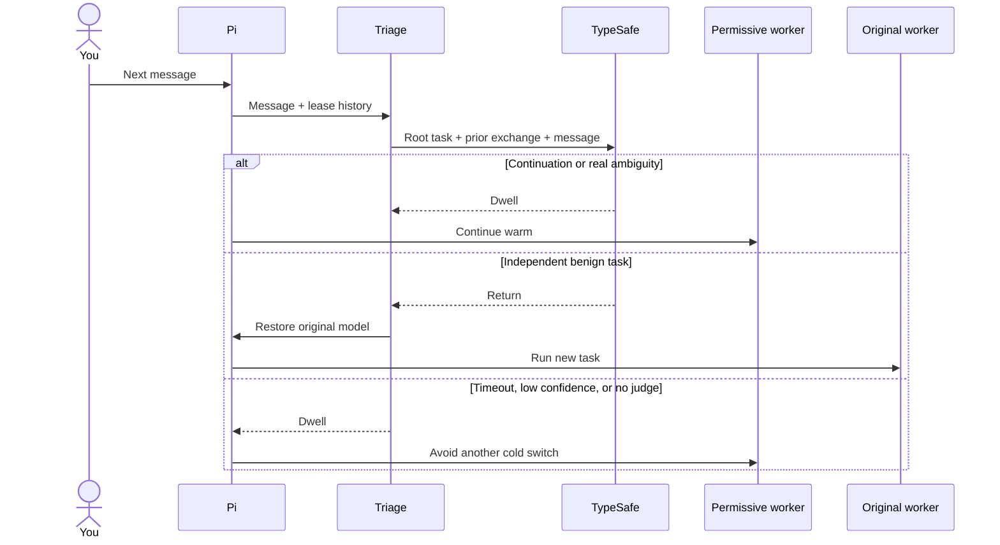
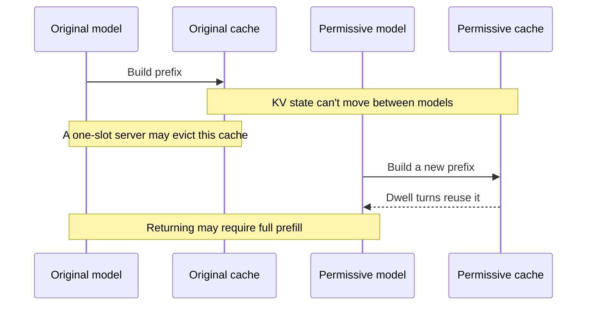

# Why did the active model change?

A model hop can avoid a refusal, but it burns the current cache. Returning
after one turn can burn it again.

**Triage routes the first turn, then leases that route until the topic has
really changed.**

## Where does a new task start?



Hardness and refusal risk are different questions. A hard ordinary task
can stay with an aligned worker and ask for specialist advice.

---

## Should the next turn stay there?



A pronoun, revision, short follow-up, or another sensitive request stays
on the lease. A clear new benign task returns.

You might think uncertainty should restore the original model. That would
turn vague follow-ups into cache-destroying ping-pong, so uncertainty
dwells.

A manual model choice cancels the lease immediately.

---

## What does a hop cost?



The lease can't save the cache across the first hop. It prevents repeated
cold switches after that hop.

---

## Which rule wins?

| Situation | Action |
| --- | --- |
| Ordinary analysis or routine work | Keep the aligned picker |
| High refusal risk on a strict cheap worker | Hop to the first available permissive model |
| Follow-up, revision, pronoun, or ellipsis | Dwell |
| Another policy-sensitive request | Dwell |
| Relationship is uncertain | Dwell |
| New benign topic is independent | Return |
| You select a model | Cancel the lease |

Permissive candidates sort local first, then by `rank`. Hosted models are
fallbacks.

---

## How do you tune it?

```jsonc
{
  "triage": {
    "enabled": true,
    "escalateThreshold": 0.75,
    "cooldownTurns": 8
  }
}
```

| Setting | What it changes |
| --- | --- |
| `triage.enabled` | Task-start and lease judgments |
| `triage.escalateThreshold` | Confidence needed for a mid-task consult suggestion |
| `triage.cooldownTurns` | Turns between suggestions |
| class `abliterated` | Marks a permissive candidate |
| class `local` | Moves that candidate ahead of hosted ones |
| model `rank` | Breaks ties inside each group |

---

## What can you inspect later?

`TriageRecord.safetyAction` keeps `hop`, `dwell`, or `return`.
`safetyConfidence` keeps the transition confidence.

The judge sees the root task and the previous exchange, not an isolated
fragment. `message_end` captures the assistant answer needed for the next
lease decision.

Implementation: `extensions/triage.ts`, `lib/config.ts`, and
`lib/consult-log.ts`.

Next: [how local cache behaves during that hop](local-qwen.md).
