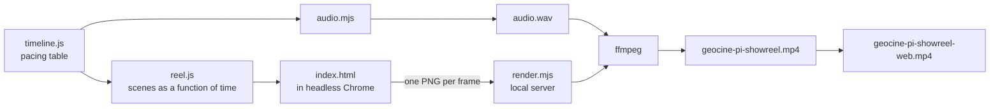

# geocine-pi showreel

A 23-second, 1080p60 motion-graphics reel that explains geocine-pi. Every frame is drawn by code, and the soundtrack is synthesized by code. There are no video or audio assets.

## How does a build work?



`render.mjs` serves the page, opens headless Chrome, and receives each finished frame over HTTP. It pipes the frames into ffmpeg together with `audio.wav`. Each frame averages 6 to 36 sub-frames to create real motion blur. That is why a full render takes about 7 minutes.

## What do you need?

- Node 18 or newer
- Chrome or Edge in the default Windows install path
- `ffmpeg` on `PATH`
- These fonts installed for your user or system: Positype Aago (`bl`, `compressed-bl`, `md`) and Fira Code (`MEDIUM`, `BOLD`)

The server loads fonts from `%LOCALAPPDATA%\Microsoft\Windows\Fonts` and `C:\Windows\Fonts`. On a machine without these fonts, text falls back to a default font.

## How do you build the video?

Run from this folder:

```bash
npm run build
```

That runs three steps. You can also run each one alone:

| Command | Output | Time |
| --- | --- | --- |
| `npm run audio` | `audio.wav` | ~2 s |
| `npm run render` | `geocine-pi-showreel.mp4`, the high-quality master (~350 MB) | ~7 min |
| `npm run web` | `geocine-pi-showreel-web.mp4`, for sharing (~14 MB) | ~20 s |

Run `npm run audio` again whenever you change `timeline.js` or `audio.mjs`. The video render reads `audio.wav` as it is on disk.

## How do you check a change without a full render?

Use stills or the live preview.

```bash
npm run stills -- 3.5,12.4,21.6
```

This writes motion-blurred PNGs to `stills/`. The times are video seconds.

```bash
npm run preview
```

This opens a player at <http://localhost:5178/> with a scrub bar, audio, and a motion-blur checkbox. Playback runs in real time without motion blur, unless you tick the checkbox and scrub.

## How do you show it as a slide?

Pick one of two ways.

**Option 1: embed the MP4 (recommended).** It has full motion blur and works on any machine.

- **PowerPoint:** Insert > Video > This Device, then pick `geocine-pi-showreel-web.mp4`. Under Playback, set Start to *Automatically* and tick *Play Full Screen*.
- **Google Slides:** upload the MP4 to Google Drive. Then use Insert > Video > Google Drive. In Format options, tick *Autoplay when presenting*.
- **Keynote:** drag the MP4 onto a slide. In Format > Movie, set it to start on click or automatically.

**Option 2: present it live in the browser.** The browser draws it in real time, so it has no motion blur, and it needs this folder, the fonts, and the local server.

```bash
npm run preview
```

Then open <http://localhost:5178/?slide>.

| Key | Action |
| --- | --- |
| Click, Space, →, or Page Down | Play / pause |
| F | Toggle full screen |
| R | Restart |

In slide mode, playback stops on the end card instead of fading to black. A presentation clicker that sends → or Page Down works too.

## How do you change it?

| To change | Edit |
| --- | --- |
| Pacing: how long each section stays on screen | `SEGMENTS` in `timeline.js` |
| Visuals, copy, colors | `reel.js`. Each scene is a function of *reel time* (0 to 15) |
| Sound | `audio.mjs`. Effects are placed with `M(reelTime)`; the groove runs on a fixed 120 BPM grid |

Each row of `SEGMENTS` is `[reelStart, reelEnd, videoSeconds]`. Stretching a row slows that section and leaves the rest alone. Keep section starts on multiples of 0.5 s so they stay on the beat. Then rebuild with `npm run build`.

## Files

| File | Role |
| --- | --- |
| `timeline.js` | Maps reel time to video time; shared by the page and the audio |
| `reel.js` | All scenes, the HUD, motion blur, and post effects (bloom, chromatic aberration, grain, vignette) |
| `index.html` | Preview player, slide mode, and the render and stills drivers |
| `render.mjs` | Local server, headless Chrome launcher, ffmpeg pipe |
| `audio.mjs` | Synth, sequencer, reverb, and master; writes `audio.wav` |

The MP4s, `audio.wav`, and `stills/` are build outputs. Don't commit the master MP4. It is several hundred MB.
